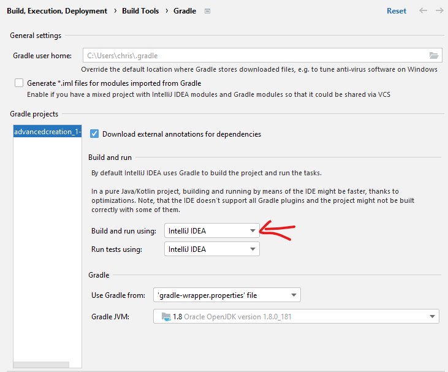
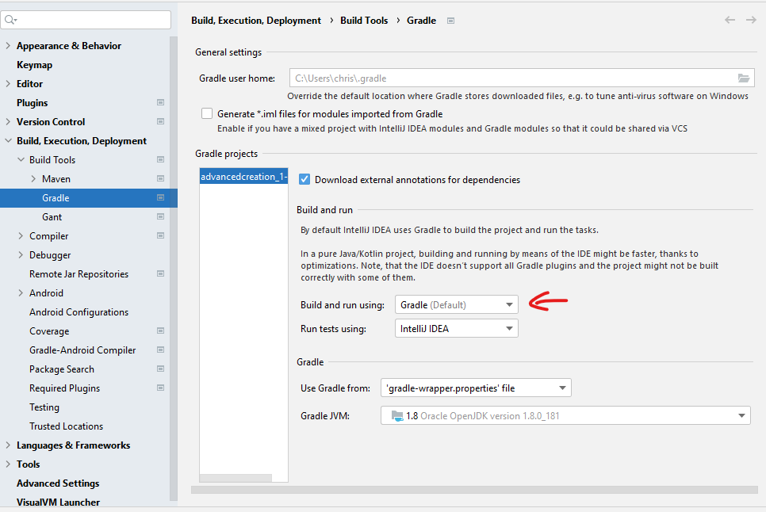

# AdvancedCreation_MC_1_12_2

The source code for Advanced Creation mod for Minecraft 1.12.2
This version uses forge-1.12.2-14.23.5.2855 which is important for the core mod to work

Much of this README is outdated information. I can't get the dev environment to run anymore due to the mixins giving errors
that I have, thus far, been unable to resolve.

Author: ChryonicWolf

## changes from 1.12 to 1.12.2

1. extendPlayerReach transformerfunction in GeneralTransformers is no longer necessary instead:  
    - SPPlayerProperties.updatePlayerProperties(TickEvent.PlayerTickEvent event)  
        contains the line: ```event.player.getEntityAttribute(EntityPlayer.REACH_DISTANCE).setBaseValue(ModPlayerControllerMP.getCustomReachDistance());```    
    - MPPlayerProperties.updatePlayerProperties(TickEvent.PlayerTickEvent event)  
        contains the line: ```event.player.getEntityAttribute(EntityPlayer.REACH_DISTANCE).setBaseValue(ModPlayerControllerMP.getCustomReachDistance());```  
        instead of :  
      ```
      if (event.player instanceof EntityPlayerMP)  
                 ((EntityPlayerMP) event.player).interactionManager.setBlockReachDistance(ModPlayerControllerMP.getCustomReachDistance());
      ```

2. The moveRelative function in Entity that is transformed by allowRelativeMovement transforming GeneralTransformers has been
    overrided by the child Class EntityLivingBase so:
   - allowRelativeMovement now transforms EntityLivingBase to call the parent method in Entity
   - AllowEntityRelativeMovement does the transformation of the Entity class with the exact same code as in 1.12

## Instructions

### new workspace setup instructions
With the use of the ASMHelper as submodule in git you need to follow different steps to setup a working workspace  

1. Load the project as a gradle project  
      Intellij should ask you if you want to load it as a gradle project when you first open it  
   
  
2. setup decomp workspace  
   ```gradlew setupDecompWorkspace```
   With me the terminal command didn't work but the gradle task via the intellij interface did. 
   
     
3. build the project using the normal gradle build task
      !!The Build task should fail with a "duplicate entry" error. Its purpose will still be complete.
   

4. setup intellijRuns  
   ```gradlew genIntellijRuns```

### install of DCEVM hotswapper
DCEVM hotswapper allows you to reload changed classes during debug run including new methods and classes£.

1. downloaded DCEVM installer: https://github.com/dcevm/dcevm/releases/tag/light-jdk8u181%2B2

2. Change the JRE used on the Minecraft Client run configuration to the 8u181 version.

3. Change the projectsettings => buildtools => gradle to the 8u181 jdk

4. change the Minecraft Client run configuration VM arguments to:
   ```-Dfml.coreMods.load=com.deadtiger.advcreation.plugin.AdvCreationCorePlugin -Xmx4G -Xms3G -XXaltjvm=dcevm -XX:+UnlockExperimentalVMOptions```

   
### reload workspace
(needed to apply accessTransformers see *_at.cfg file)

1. setup decomp workspace  
   ```gradlew setupDecompWorkspace```
   
  
2. setup intellijRuns  
   ```gradlew genIntellijRuns```  
   notes:  
   - if the gradlew genIntellijRuns give a NullPointerReference error, refresh gradle and run genIntellijRuns via the intellij GUI gradle view
   
### update Intellij IDE to newer version
(Has a bug where dependencies are not refreshed(can't find mod resourceLocation (assets)))
  
1.Make sure the following lines are in the build.gradle file at the bottom  
  (not in processResources just the bottom)  
```
sourceSets {
main { output.resourcesDir = output.classesDir }
} 
```  
  
2. setup decomp workspace with refreshed dependencies  
   ```gradlew setupDecompWorkspace idea --refresh-dependencies```
   
  
3. setup intellijRuns (Might not be necessary but can't hurt)  
   ```gradlew genIntellijRuns```  
   
notes:  
- to build the jars you have to comment out the lines in step 1 and run step 2 again and delete the ".gradle" and "build" folders before running the build task

### run client with core mods 

1. make sure you have "add VM options" enabled in the "modify Options" dropdown box in the "edit configurations..." menu of the Minecraft Client task  


2. add the following to the VM options :  
   ```-Dfml.coreMods.load=com.deadtiger.advcreation.plugin.AdvCreationCorePlugin -XX:+UnlockCommercialFeatures -Xmx4G -Xms3G```


3. make sure you have "use classpath of module" enabled in the "modify Options" dropdown box in the "edit configurations..." menu of the Minecraft Client task  


4. choose "advancedcreation.main" as classpath

### problems with find usages in the libraries

1. gradle task cleanCache
   ```gradlew cleanCache```
   

2. gradle task setupDecompWorkspace
   ```gradlew setupDecompWorkspace```

### problems adding dependences to the dev environment
This should work I think.
1. gradle task cleanCache
   ```gradlew clean```


2. gradle task setupDecompWorkspace
   ```gradlew buildDependents```

### problems loading asm-util.jar from gradle home during run client
an error like this:
   ```
   Client thread/ERROR] [FML]:  
   There was a problem reading the entry module-info.class in the jar 
   C:\Users\Liplum\.gradle\caches\modules-2\files-2.1\org.ow2.asm\asm-analysis\6.2\
   c7d9a90d221cbb977848d2c777eb3aa7637e89df\asm-analysis-6.2.jar
    - probably a corrupt zip
   net.minecraftforge.fml.common.LoaderException: java.lang.IllegalArgumentExceptiongradlew clean
   ```
Fix:
1. change intellij settings to
   
2. run runClient and the program should start
3. return intellij settings to 
  

this doesn't always work

Good Fix!:
1.  Set java environment variable to jdk1.8.0_181: do this by removing all java paths in the path system variable
    and adding C:\Program Files\Java\jdk1.8.0_181\bin instead [https://www.geeksforgeeks.org/how-to-set-java-path-in-windows-and-linux/](https://www.geeksforgeeks.org/how-to-set-java-path-in-windows-and-linux/)
2.  Set JAVA_HOME system environment variable to C:\Program Files\Java\jdk1.8.0_181\
3.  Set the gradle setting in Intellij to C:\Program Files\Java\jdk1.8.0_181
4.  Set the run configuration compiler to C:\Program Files\Java\jdk1.8.0_181

### problem with running gradlew from terminal

1. probably because JAVA_HOME is not set to the right version of java


## extra information

### Keycodes
left arrow:     203  
down arrow:     208  
right arrow:    205  
up arrow:       200  
page up:        201  
page down:      209  